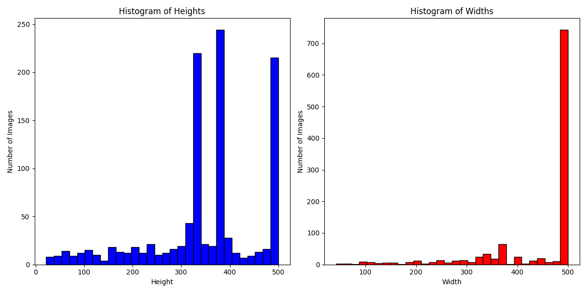

# Download dataset

```.bash
$ chmod +x download_and_extract.sh
$ ./download_and_extract.sh
```

# Download checkpoint
```.bash
$ inference.py
```

TODO: reqs txt

# EDA

Class distribution


Image height and width distribution


